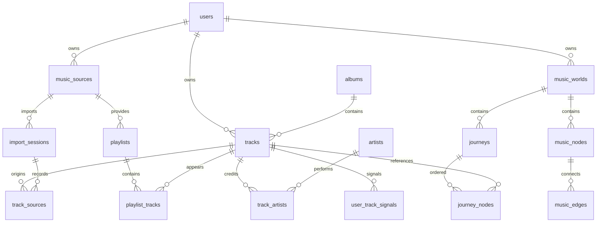

> 历史说明：以下 SQLite/腾讯云内容对应 master 版本。codex/render-neon 发布分支改用 PostgreSQL；当前部署请遵循 [Render + Neon 指南](DEPLOY_RENDER_NEON.md)。

# 数据库约定与持久化

Day 1 固定 SQLite + Drizzle schema。Day 2 已接入 better-sqlite3、匿名会话、事务导入、删除和世界保存；`0000`、`0001` 两份迁移由应用初始化时自动执行，迁移记录防止重复执行。

## 表与关系

| 表 | 责任与关系 |
| --- | --- |
| users | 匿名用户 UUID；只存会话 token 哈希，原 token 放 HttpOnly Cookie |
| music_sources | 每用户/Provider 一条音乐来源配置；不是授权凭证容器 |
| import_sessions | 所属用户、scope、音乐来源、文件名/hash、唯一 batchKey、状态、统计与筛选后的完整报告 |
| tracks | 所属用户、内部 UUID、标题、canonicalKey、ISRC、版本、时长、专辑与显式流派 |
| track_sources | 多来源记录；所属 Track、来源、导入会话、外部 ID、白名单 metadata；用户内 sourceKey 唯一 |
| artists | 内部 UUID、名称、规范化名称；同名不强制唯一 |
| albums | 内部 UUID、名称、规范化名称、可选日期；同名不强制唯一 |
| track_artists | Track 与 Artist 多对多，带主次顺序 |
| playlists | 真实声明歌单；内部 UUID 与平台 externalId 分离；用户内 playlistKey 唯一 |
| playlist_tracks | 歌单成员关系、位置，同一歌单同曲不重复 |
| user_track_signals | 每用户/Track 一条；liked、recentlyPlayed、recentScore 可空 |
| music_worlds | 用户所属的世界、scope、库指纹、歌曲/隐藏歌曲总量与群组 |
| music_nodes | 世界中的歌曲/艺术家/专辑/流派节点；实体引用由外键保证 |
| music_edges | 同一用户同一世界内的节点连接、类型、理由、权重及真实歌曲/歌单证据 |
| journeys | 世界下的路线、意图、生成模式（deterministic/ai） |
| journey_nodes | 有顺序的真实 Track 引用与理由，同一路线不重复歌曲 |

## 不可破坏的约定

1. 所有实体主键由应用生成 UUID；迁移中的 SQL 列不使用伪随机平台 ID 或 SQL 自增主键代替。Zod 在 API 边界校验请求；ORM 插入时 `$defaultFn` 生成 UUID。
2. 用户归属由匿名会话决定，不接受客户端提交的 `userId` 作为授权依据。查询仍须按当前会话约束。
3. 复合外键 `user_id + id` 防止把甲用户的 Track/Album/Source 引到乙用户的数据下；Edge 的复合外键还限制 worldId 一致。
4. `canonical_key`、`isrc` 建索引而非唯一约束，为版本/证据冲突保留多条歌曲。
5. 持久化 sourceKey 依据经验证的来源身份生成；文件哈希在导入边界计算。外部 ID 非全局唯一，至少要与 Provider、用户组合。
6. ImportSession 对应 File 导入通道时，TrackSource 的 MusicSource 可指向用户声明的 QQ/网易来源；这是导入通道与声明平台的区别，不代表授权成功。
7. 删除库采用事务，先清派生 World/Journey，再清源数据/关系，保留匿名用户和其他用户；整体删除用户则依赖 cascade。不能以某个 worldId 本身充当访问凭证。
8. NULL 表示未知收藏/播放，不能替换为 false 或伪造 true。存储的数据来自经校验的显式导入字段。
9. Demo 模板放应用固定数据资源，体验时创建会话内 `scope=demo` 副本。真实库为 `scope=library`；艺术家/专辑/歌单身份键同时含 scope。当前用户删除不能删除模板。

## D2 已接线

1. 选定 SQLite 驱动与持久化目录，启用 foreign_keys、事务和迁移版本表；首次启动自动初始化。
2. 实现匿名会话 Cookie/token 哈希与用户范围存取。
3. 把已验证的导入结果事务写入导入会话、Track/Source、Artist/Album、Playlist 关系和真实信号；验证反复导入幂等。
4. 实现文件导入、标准化、读取、删除接口；上传前限制请求体并复用现有解析边界。
5. 做两个匿名会话隔离、刷新/重启持久性、事务回滚、删除联动的集成测试。

生成命令 `npm run db:generate` 不需要数据库配置，不会应用迁移。初始 SQL 位于 `src/db/migrations/`，后续结构变更必须新增迁移而不是改写已部署历史。

连接开启外键、WAL、5 秒 busy timeout 与 synchronous FULL。导入、删除、世界生成使用同步 `BEGIN IMMEDIATE` 事务；库读取与写入使用当前用户过滤。数据库路径由 `DATABASE_PATH` 指定，生产不能放在临时容器层。`npm run db:init` 可手动初始化/校验。

世界保留生成时的节点、边、解释和数量快照。新导入不会覆盖旧世界；同名、同 scope、同库指纹的请求复用原世界。最多 18 个歌曲节点加 12 个有实际支持的聚合节点，小库按实际数据展示。聚合排序使用人数和可读名称，不以随机 UUID 决定选择。群组是同艺术家/流派的事实分组，尚未引入无监督相似度模型。

## D3 Journey

`journeys` 记录当前用户、世界、标题、意图、模式与时间。`journey_nodes` 记录有序歌曲 ID 和每一站的理由；用户+路线+位置为主键，用户+路线+歌曲唯一。创建时先验证世界归属与起点是该世界的真实节点，再用当前 scope 中的歌曲规划，整个保存过程使用同步事务。读取路线再次按用户过滤；删除当前音乐库时，世界与路线通过外键级联一起清除。

基础算法从当前歌曲出发，或从所选艺术家/专辑/流派节点关联的真实歌曲中选起点；下一站按共同艺术家、专辑、显式歌单、流派和已导入的明确偏好排序。理由只陈述能证明的关系；完全无关系时写明是探索跳转。歌曲不足 5 首时只返回实际数量。路线边代表旅行次序，地图用虚线与事实关系线区分。路线保存歌曲的真实 ID；如果歌曲原本不属于 15–30 个主要节点，地图仅在展示该 Journey 时增补路线站点。

## D4 模型接口预留

Journey 表已有 `intent` 与 `mode`，无需迁移。模型输入限定当前用户的起点、最多 40 首候选歌曲、最多 80 条已存关系及 120 字方向；不发送来源 URL、外部账号、原始元数据或密钥。输出由 Zod 与候选集合双重校验：长度、首站、歌曲归属、重复和理由。只有通过校验才保存 `mode=ai`；否则保存真实歌曲组成的 `mode=deterministic`。模型请求在数据库事务外执行，保存时重新读取当前库并校验，防止等待模型期间音乐库变化。Guide 的预留上下文只含当前节点、显式导入信号、附近真实节点、最近 Journey 和问题。
